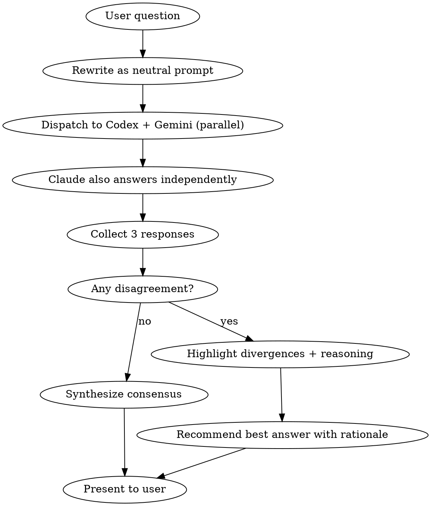

# Council — Three-Model Ensemble

Claude Code coordinates Codex (GPT) and Gemini as advisors. All three answer the same question independently, then Claude synthesizes the best response.

## When to Use

- Uncertain about correctness (API behavior, library quirks, facts)
- Architecture/tech decisions with tradeoffs
- Security audit or code review (more eyes = fewer blind spots)
- Debugging a stubborn issue — different diagnostic approaches
- User explicitly asks for multi-model opinion

## When NOT to Use

- Simple, mechanical tasks (CRUD, formatting, file ops)
- Urgent fixes where latency matters
- Purely subjective choices (naming, style)
- Tasks that only need one tool's output (image gen, video)

## Workflow



### Step 1: Rewrite the Prompt

Convert user's question into a **neutral, self-contained prompt** suitable for all models. Include:

- Full context (code snippets, error messages, constraints)
- No references to "Claude" or other model names
- Clear ask: "Provide your analysis of..." or "What is the best approach to..."

### Step 2: Dispatch in Parallel

Call both MCP tools simultaneously:

**Codex:**

```
mcp__codex__codex({
  prompt: "<neutral prompt>",
  cwd: "<relevant project dir>",
  sandbox: "read-only"
})
```

**Gemini:**

```
mcp__gemini-cli__ask-gemini({
  prompt: "<neutral prompt>"
})
```

**Claude:** Think through the answer yourself BEFORE reading Codex/Gemini responses (prevents anchoring bias).

### Step 3: Synthesize

Present results in this format:

```
## Council Results

### Consensus (if all agree)
[The shared answer]

### Divergences (if any)
| Aspect | Claude (Opus) | Codex (GPT) | Gemini |
|--------|---------------|-------------|--------|
| [topic] | [position]   | [position]  | [position] |

### Recommendation
[Your synthesized best answer with reasoning for why you picked this over alternatives]

### Confidence
[High/Medium/Low] — based on agreement level and evidence quality
```

## Key Rules

1. **Claude answers FIRST** (before reading other responses) to avoid anchoring
2. **No leading questions** — same neutral prompt to both tools
3. **Codex sandbox = read-only** unless the question requires code execution
4. **If one tool fails** (timeout, auth error), proceed with 2/3 and note the gap
5. **Don't force consensus** — disagreement IS the value; show it clearly

## MCP Tool Reference

| Tool                          | Model  | Use For                                                         |
| ----------------------------- | ------ | --------------------------------------------------------------- |
| `mcp__codex__codex`           | GPT    | Code analysis, general reasoning                                |
| `mcp__codex__codex-reply`     | GPT    | Follow-up in same thread                                        |
| `mcp__gemini-cli__ask-gemini` | Gemini | Analysis, search-enhanced answers                               |
| `mcp__gemini-cli__brainstorm` | Gemini | Creative ideation (use instead of ask-gemini for brainstorming) |

## Modes

**`/council <question>`** — Standard 3-way analysis (default)

**`/council review <file or code>`** — Code review: each model independently reviews, then merge findings

**`/council debug <error or symptom>`** — Debugging: each model proposes root cause and fix, then compare

**`/council brainstorm <topic>`** — Creative: use `mcp__gemini-cli__brainstorm` instead of `ask-gemini`, then synthesize all ideas
